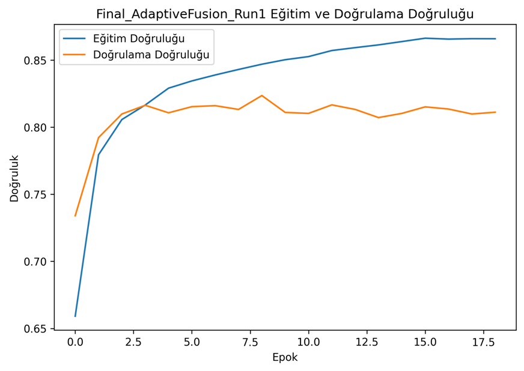
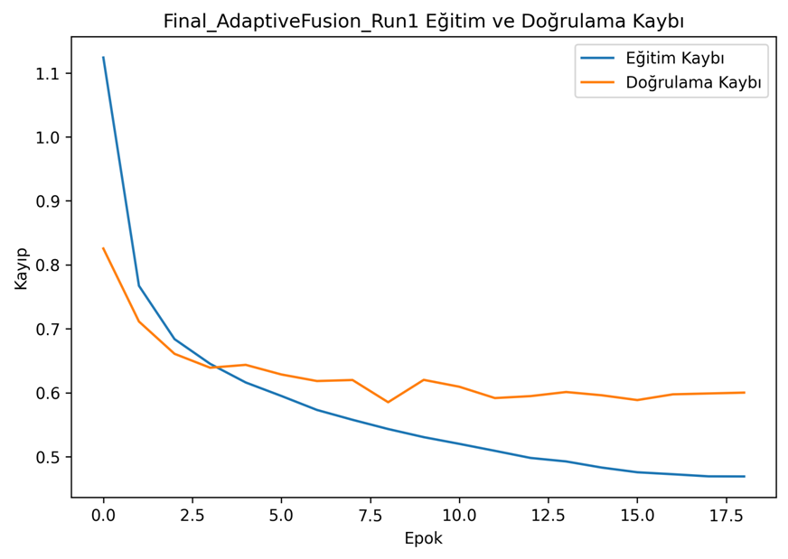
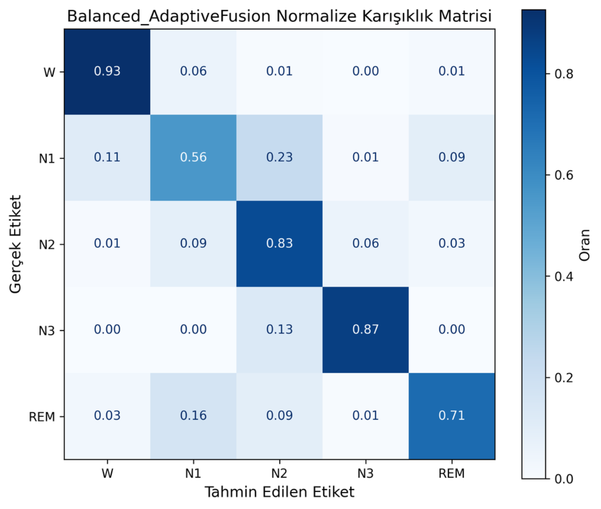
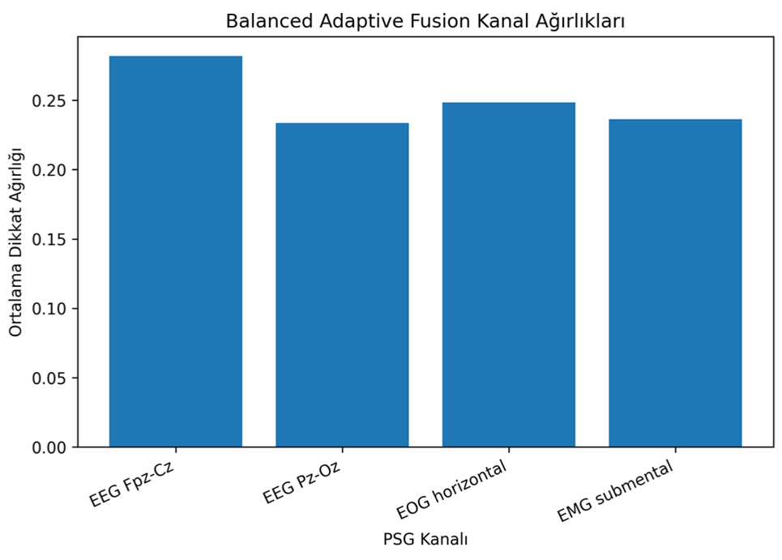
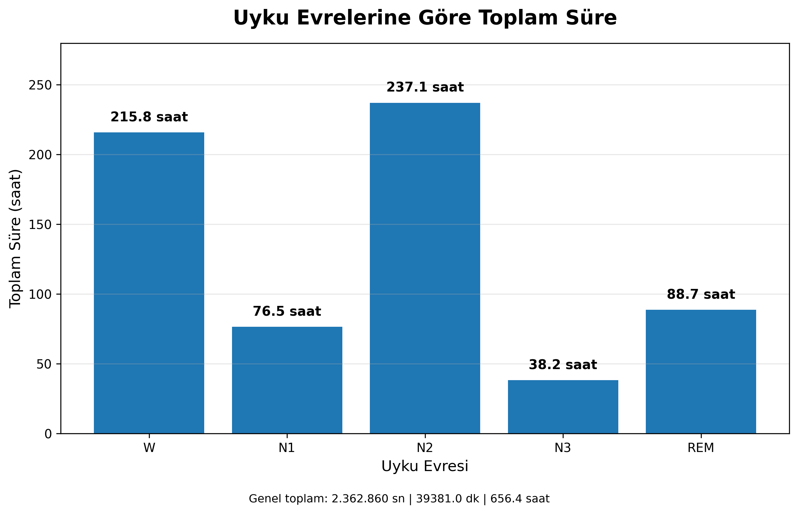
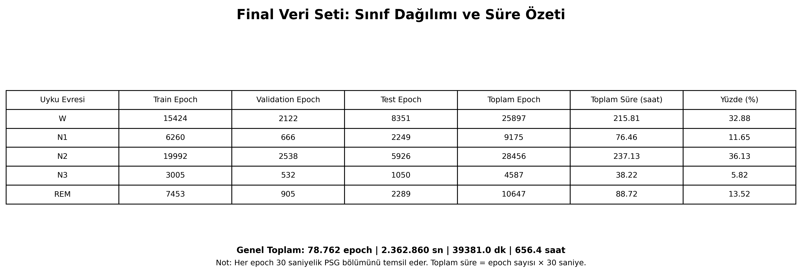

# Sleep Stage Classification from Multi-Channel PSG Signals

This repository contains a subject-wise sleep-stage classification pipeline for
multi-channel polysomnography (PSG) signals from the Sleep-EDF Sleep Cassette
(SC) dataset. It compares conventional machine-learning baselines with deep
learning architectures and an adaptive channel-fusion model.

The task is five-class classification of **W, N1, N2, N3, and REM**. Particular
attention is given to class imbalance and the difficult transitional N1 stage.

## Dataset

The project uses the **Sleep-EDF Expanded – Sleep Cassette** recordings,
available from [PhysioNet](https://physionet.org/content/sleep-edfx/1.0.0/).
The raw recordings are not redistributed in this repository.

The four PSG channels used in the experiment are:

- EEG Fpz-Cz
- EEG Pz-Oz
- EOG horizontal
- EMG submental

Signals are divided into 30-second epochs. Sleep-stage annotations are mapped to:

| Label | Stage |
|---:|---|
| 0 | W |
| 1 | N1 |
| 2 | N2 |
| 3 | N3 |
| 4 | REM |

## Processed data format

The modular pipeline starts from a processed NPZ cache rather than directly
from raw EDF files. By default, it expects:

```text
data/processed_dataset_final.npz
```

The archive must contain the following arrays:

| Key | Required shape | Description |
|---|---|---|
| `X_feat_seq` | `(epochs, sequence_steps, features)` | Sequential handcrafted features |
| `X_feat_center` | `(epochs, features)` | Center-epoch feature vectors |
| `X_raw_center` | `(epochs, timepoints, 4)` | Raw center epochs in the documented channel order |
| `y_seq` | `(epochs,)` | Integer labels from 0 to 4 |
| `subject_seq` | `(epochs,)` | Subject identifier for every epoch |
| `feature_names` | `(features,)` | Optional feature names |

All arrays must contain the same number of epochs. Subject identifiers are used
to keep each participant entirely within one split.

The original Google Colab analysis in
[`notebook/sleep_edf_colab.ipynb`](notebook/sleep_edf_colab.ipynb) uses the
same processed cache. The raw EDF-to-NPZ preprocessing workflow is not included,
so the published results require the project cache produced during the original
study. This limitation is stated explicitly to avoid implying full raw-data
reproducibility.

## Methodology

1. Load and validate the processed PSG cache.
2. Create subject-wise 70% train, 10% validation, and 20% test splits.
3. Fit feature scalers using training subjects only.
4. Train machine-learning and deep-learning models with class weighting.
5. Select deep-learning checkpoints using validation loss.
6. Evaluate models once on the held-out subject-level test set.
7. Save configuration, package versions, split assignments, metrics, models,
   confusion matrices, learning curves, and channel weights.

Machine-learning models are fitted on the combined training and validation
partitions. Deep-learning models use the training partition for fitting and the
validation partition for checkpoint selection.

## Models

### Machine learning

- Random Forest
- Support Vector Machine (SVM)
- XGBoost

### Deep learning

- Multilayer Perceptron (MLP)
- 1D CNN
- BiLSTM with Attention
- CNN-BiLSTM
- CNN-BiLSTM with Adaptive Fusion

## Adaptive Fusion

The Adaptive Fusion architecture learns the relative contribution of each PSG
channel rather than treating all channels equally. It combines CNN-based local
feature extraction, BiLSTM temporal modeling, attention, learned channel
weights, and fully connected classification layers.

## Evaluation metrics

- Accuracy
- Macro precision
- Macro recall
- Macro F1-score
- Weighted F1-score
- Cohen's kappa
- Class-wise precision, recall, and F1-score

## Reported results

The stored final Adaptive Fusion run achieved:

| Metric | Score |
|---|---:|
| Accuracy | 82.62% |
| Macro F1 | 75.66% |
| Cohen's kappa | 75.51% |

The normalized confusion matrix shows stronger performance for W, N2, and N3,
while N1 remains the most challenging stage. These values describe the stored
project run and should not be interpreted as clinical performance.

| Training accuracy | Training loss |
|---|---|
|  |  |

| Confusion matrix | Adaptive channel weights |
|---|---|
|  |  |

### Dataset summary

| Sleep-stage duration | Dataset overview |
|---|---|
|  |  |

## Repository structure

```text
sleep_edf_sleep_stage_classification/
├── notebook/
│   └── sleep_edf_colab.ipynb
├── results/
├── src/
│   ├── __init__.py
│   ├── config.py
│   ├── data_utils.py
│   ├── evaluation.py
│   ├── main.py
│   ├── models.py
│   └── training.py
├── .gitignore
├── README.md
└── requirements.txt
```

## Installation

Python 3.10 or 3.11 is recommended.

```bash
git clone https://github.com/ecetulumen/sleep_edf_sleep_stage_classification.git
cd sleep_edf_sleep_stage_classification

python -m venv .venv
source .venv/bin/activate
pip install -r requirements.txt
```

On Windows:

```powershell
.venv\Scripts\activate
pip install -r requirements.txt
```

## Quick software check

A synthetic smoke test verifies data validation, model construction, training,
evaluation, and output generation without using Sleep-EDF research data:

```bash
python -m src.main --smoke-test
```

Smoke-test scores are synthetic and must not be reported as research results.

## Validate a processed dataset

Before training, inspect the expected shapes and participant split:

```bash
python -m src.main \
  --cache-path data/processed_dataset_final.npz \
  --check-data \
  --trust-npz
```

Use `--trust-npz` only for a cache you created or trust. It is needed when the
archive stores subject identifiers or feature names as NumPy object arrays.

## Run the experiment

Run every model:

```bash
python -m src.main \
  --cache-path data/processed_dataset_final.npz \
  --result-dir results/runs \
  --trust-npz
```

Run only selected models:

```bash
python -m src.main \
  --cache-path data/processed_dataset_final.npz \
  --models rf svm xgb adaptive \
  --trust-npz
```

Available model keys are `rf`, `svm`, `xgb`, `mlp`, `cnn1d`,
`bilstm`, `cnn_bilstm`, and `adaptive`.

Each execution creates a timestamped output directory so that previous models
and reports are not overwritten.

## Reproducibility and limitations

- Train, validation, and test partitions are separated by subject.
- Feature scaling is fitted only on training subjects.
- Random seeds and installed package versions are saved with each run.
- The repository does not include raw EDF files or the original EDF-to-NPZ
  feature-extraction stage.
- Exact replication of the reported scores therefore requires the original
  processed cache.
- This project is intended for research and educational use and is not a
  medical diagnostic system.
